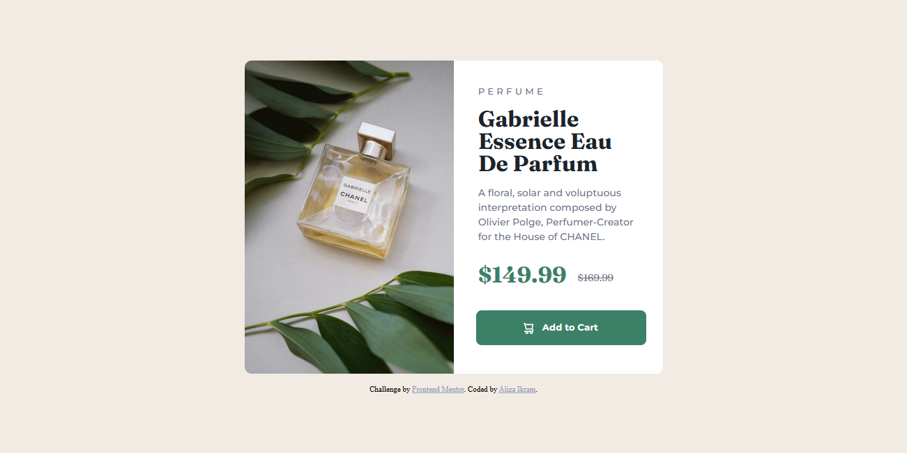

# Frontend Mentor - Product preview card component solution

This is a solution to the [Product preview card component challenge on Frontend Mentor](https://www.frontendmentor.io/challenges/product-preview-card-component-GO7UmttRfa). Frontend Mentor challenges help you improve your coding skills by building realistic projects.

## Table of contents

- [Overview](#overview)
  - [The challenge](#the-challenge)
  - [Screenshot](#screenshot)
  - [Links](#links)
- [My process](#my-process)
  - [Built with](#built-with)
  - [What I learned](#what-i-learned)
  - [Continued development](#continued-development)
  - [Useful resources](#useful-resources)
- [Author](#author)
- [Acknowledgments](#acknowledgments)

**Note: Delete this note and update the table of contents based on what sections you keep.**

## Overview

### The challenge

Users should be able to:

- View the optimal layout depending on their device's screen size
- See hover and focus states for interactive elements

### Screenshot

- 
- 
- 

### Links

- Solution URL: [Add solution URL here](https://your-solution-url.com)
- Live Site URL: [Product Card Preview](https://product-card-preview-component-main.netlify.app)

## My process

### Built with

- Semantic HTML5 markup
- CSS custom properties
- Flexbox
- CSS Grid
- Mobile-first workflow

### What I learned

I learned how to replace the image with another one for different screen sizes by using Picture element.

### Continued development

I will focus on more practicing Mobile-first approach and making code clean.

### Useful resources

- [Web dev](https://web.dev/learn/design/picture-element) - This is an amazing article which helped me understand picture element which chooses the image depending on the screen size. I'd recommend it to anyone still learning this concept.

## Author

- Linkedin - [Aliza Ikram](https://www.linkedin.com/in/aliza-ikram)
- Frontend Mentor - [@AlizaIkram](https://www.frontendmentor.io/profile/AlizaIkram)
